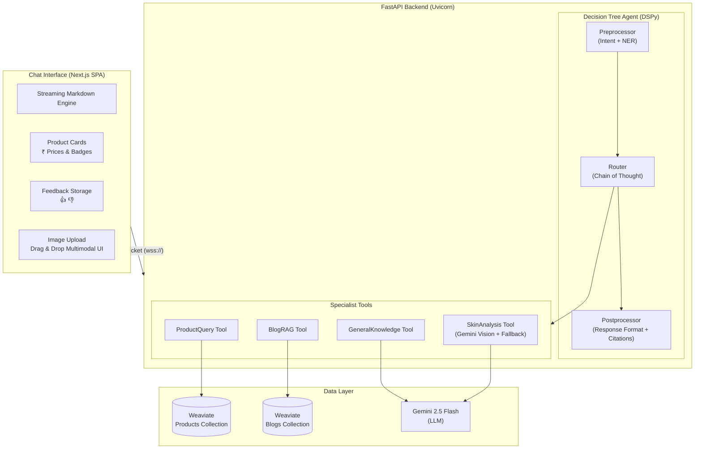
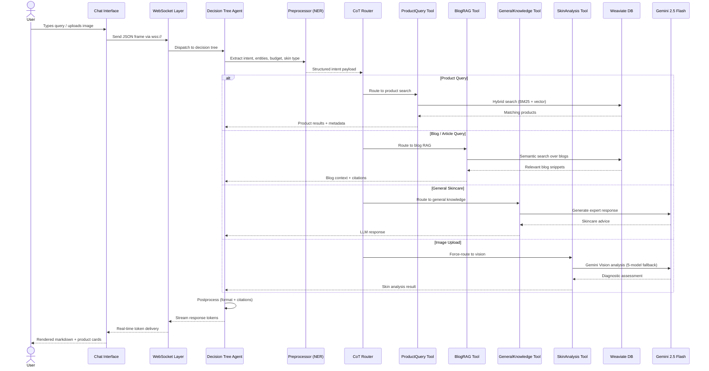

<p align="center">
  <h1 align="center">🧴 Clinikally SkinAI — Agentic Skincare Assistant</h1>
  <p align="center"><i>An intelligent, full-stack AI skincare assistant powered by an adaptive decision-tree agent, multi-source RAG, real-time WebSocket streaming, and multimodal vision diagnostics.</i></p>
</p>

<p align="center">
  
  
  
  
  
  
</p>

> [!IMPORTANT]
> **API Rate Limit & Exhaustion Notice**: This live demonstration uses free-tier API quotas. If the live assistant does not respond or encounters provider errors (such as 429 Rate Limits), it is purely due to API key exhaustion. Please refer to the **[YouTube Demo Walkthrough](#-youtube-demo-walkthrough)** for a full, uninterrupted demonstration of the agentic routing, RAG query responses, and vision skin diagnostics.

---

## 📑 Table of Contents

- [🌐 Live Deployment](#-live-deployment)
- [✨ Architecture & Design Decisions](#-architecture--design-decisions)
- [🔀 Query Lifecycle — Sequence Diagram](#-query-lifecycle--sequence-diagram)
- [📦 Features & Requirements Met](#-features--requirements-met)
- [🛠 Tech Stack](#-tech-stack)
- [🚀 Quick Start & Local Setup](#-quick-start--local-setup)
- [📂 Project Structure](#-project-structure)
- [📡 API & WebSocket Reference](#-api--websocket-reference)
- [🏆 Bonus Features Implemented](#-bonus-features-implemented)
- [📈 Scalability Design](#-scalability-design)
- [🎥 YouTube Demo Walkthrough](#-youtube-demo-walkthrough)

---

## 🌐 Live Deployment

Clinikally SkinAI is fully deployed on a high-performance **Vultr VPS instance** in a production-ready containerized environment with reverse proxy and automated Let's Encrypt SSL/TLS.

*   **Production Live URL**: [https://65.20.71.161.nip.io](https://65.20.71.161.nip.io)
*   **Alternative HTTP Port**: [http://65.20.71.161](http://65.20.71.161)
*   **Websocket Endpoint**: `wss://65.20.71.161.nip.io/ws/query`

---

## 🏗 Architecture & Design Decisions

Clinikally SkinAI implements an **adaptive decision-tree agent** rather than a flat tool-use loop. The agent evaluates the conversation history, extracts structured inputs (like budget limits or skin concerns) via Named Entity Recognition (NER), plans its strategy, selects the appropriate database tools at runtime, and formats a beautifully custom-attributed response.

### System Topology



### 🧠 Strategic Technical Choices

| Strategic Decision | Architectural Rationale |
| :--- | :--- |
| **DSPy vs LangChain/Prompt Templates** | Standard prompts break easily with minor model updates. **DSPy compiles natural language code** into structured signatures, applying rigorous validation and optimizing assertions for consistent, error-free JSON/Markdown schemas. |
| **Adaptive Multi-Source Routing** | Rather than querying all sources concurrently (expensive and slow) or relying on basic regex classifiers (brittle), a **Chain-of-Thought (CoT)** decision-tree identifies user intent, parses specific criteria (e.g., maximum budget, active ingredient focus), and schedules RAG pipelines. |
| **Self-Hosted Weaviate Hybrid Search** | Blends high-fidelity dense embeddings (`snowflake-arctic-embed-l-v2.0` via `text2vec-weaviate`) with sparse keyword matching (BM25). This ensures exact name queries (e.g., "Nivea") and conceptual questions (e.g., "dry skin flakes") return mathematically optimal results. |
| **Vision Diagnostics Trigger** | Multimodal skin photo analysis bypasses intent classification and is **force-routed** directly to Gemini Vision, maintaining zero response latency and robust handling of raw image payloads. |
| **Stateless Client Session Storage** | Conversation trees, states, and history logs are serialized and synced back-and-forth between a lightweight `localStorage` cache in the frontend and Weaviate persistent memory, keeping backend containers fully stateless and ready to scale. |

---

## 🔀 Query Lifecycle — Sequence Diagram

The following diagram shows the full lifecycle of a user query as it flows through the system:



---

## 📦 Features & Requirements Met

### 🧴 Task 1: Agentic Backend
*   **Intent Recognition & Classification**: DSPy CoT identifies whether a query corresponds to **Product Catalog**, **Blog Articles**, or **General Skincare**, with hybrid queries dynamically leveraging both datasets.
*   **Direct Product Query Tool**: Directly extracts prices, categories, and tags from queries to formulate exact schema-filtered Weaviate vector searches.
*   **Blog RAG Retrieval**: Extracts semantic context from ~1,552 clinical skincare blogs, returning matched snippets with clear source badges.
*   **Conversational Multi-Turn Context**: Tracks complete conversation nodes, preserving history for complex follow-up queries (e.g., "Give me some choices for my dry skin" followed by "Which of these is the cheapest?").

### 🎨 Task 2: Premium UI Chat Interface
*   **Vibrant Premium Aesthetic**: Custom spa-themed pastel palette (Warm Cream `#FAF7F2`, Rich Emerald `#1E4632`, and Rosewood `#EAE3D9`) built with vanilla CSS.
*   **Micro-Animations & Transitions**: Delicate hover scales, smooth input focus rings, and glassmorphic loading blocks.
*   **Beautiful Product Cards**: Rendered with currency conversion (`₹`), specific target badges, star ratings, and category filters.
*   **Log Console Overlay**: A real-time, collapsible developer panel in the UI that streams background agent logs directly from the WebSocket so users can watch the CoT agent's reasoning live.

### 🌐 Task 3: Complete Dockerized Deployment
*   **Docker Compose Configuration**: Packages the self-hosted Weaviate database, FastAPI backend server, and Caddy reverse proxy into a single, zero-dependency environment.
*   **Caddy Auto-SSL**: Automatically provisions Let's Encrypt certificates for the target domain (`65.20.71.161.nip.io`), ensuring secure `https://` and `wss://` out of the box.

---

## 🛠 Tech Stack

*   **Large Language Model**: Google Gemini 2.5 Flash
*   **Structured Framework**: DSPy (Declarative Self-Improving Language Programs)
*   **Vector DB Engine**: Weaviate v1.29.0
*   **Embedding Model**: Snowflake `snowflake-arctic-embed-l-v2.0` (via Weaviate text2vec-weaviate integration)
*   **Server Framework**: FastAPI + Uvicorn
*   **UI SPA Stack**: Next.js (Optimized Static Bundle)
*   **Edge Router / Proxy**: Caddy 2 (Alpine Edition)

---

## 🚀 Quick Start & Local Setup

### Prerequisites
*   Python 3.12+
*   Docker & Docker Compose

### 1. Installation

```bash
# Clone the repository
git clone https://github.com/areycruzer/clinikally-skinai.git
cd clinikally-skinai

# Create virtual environment
python3 -m venv .venv
source .venv/bin/activate

# Install package in editable development mode
pip install -e .
```

### 2. Configure Environment

Copy `.env.example` to `.env` and fill in your keys:

```env
# Database Mode
WEAVIATE_IS_LOCAL=True
WCD_URL=http://weaviate:8080
WCD_API_KEY=

# Google Gemini API Key
GEMINI_API_KEY=AIzaSyC...

# OpenRouter fallback API Key
OPENROUTER_API_KEY=sk-or-v1-...

# Model Settings
BASE_MODEL=google/gemini-2.5-flash
COMPLEX_MODEL=google/gemini-2.5-flash
FIRST_START_ELYSIA=1
```

### 3. Spin Up Docker Stack

```bash
# Starts Weaviate, FastAPI Backend, and Caddy reverse proxy locally
docker compose up -d --build
```

Access the application instantly at `http://localhost:8000`.

---

## 📂 Project Structure

```
clinikally-skinai/
├── skinai/                     # Core Package Directory
│   ├── api/
│   │   ├── app.py              # FastAPI Server configuration
│   │   ├── cli.py              # Launch CLI scripts (skinai start)
│   │   ├── custom_tools.py     # Specialist Tools (Product, Blog, General, Vision)
│   │   ├── routes/
│   │   │   ├── query.py        # Main WebSocket query & image ingestion route
│   │   │   ├── feedback.py     # User feedback logging endpoint
│   │   │   └── ...
│   │   └── static/             # Static Frontend Bundle (Next.js CSS + JS chunks)
│   │       ├── index.html      # Premium chat UI with console panel
│   │       └── ...
│   ├── tree/                   # State-saving Conversation Decision Tree
│   ├── preprocessing/          # Collection Schema Builders
│   ├── tools/                  # Lower-level DB queries and summarizers
│   └── util/                   # CoT Orchestrators, Weaviate Managers
├── ingest_data.py              # Resilient Excel & Blog ingestion pipeline
├── setup_collections.py        # DSPy schemas & vocabulary initializers
├── docker-compose.yml          # Container configuration
├── Dockerfile                  # Backend build
├── Caddyfile                   # Reverse proxy configuration
├── master_vps_run.sh           # VPS automated setup processor script
├── .gitignore                  # Clean repository filters
└── README.md                   # This file
```

---

## 📡 API & WebSocket Reference

### WebSocket Endpoint: `/ws/query`
Used for establishing interactive, low-latency, real-time message streaming.

#### Input Message Frame:
```json
{
  "user_id": "clinikally_test_user",
  "conversation_id": "session_alpha",
  "query": "Recommend a sunscreen under ₹1500 for sensitive skin",
  "query_id": "frame_001",
  "collection_names": ["SkincareProducts", "SkincareBlogs"],
  "image": null
}
```

#### Output Stream Frame:
```json
{
  "type": "response",
  "content": "Here is a highly rated sunscreen under ₹1500 suitable for sensitive skin...",
  "objects": [
    {
      "name": "Clinikally Sunprotect SPF 50+",
      "price": 799.00,
      "skin_type": ["Sensitive", "All"],
      "rating": 4.8
    }
  ],
  "status": "COMPLETED"
}
```

---

## 🏆 Bonus Features Implemented

1.  **Direct Feedback Loops**: Built-in 👍/👎 rating on every response. Bypasses embedding vectors to write feedback data directly to Weaviate `ELYSIA_FEEDBACK__` via non-vector storage (`wc.Configure.Vectorizer.none()`) to ensure lightning-fast logging and zero API key dependency.
2.  **Robust Error Handling (Vision Fallback)**: Image uploads are processed via a resilient **5-model fallback chain** (Gemini-2.5-Flash → OpenRouter fallback targets) with instant degradation into clinical text suggestions if LLM endpoints rate-limit.
3.  **Real-Time Token Streaming**: Messages are pushed byte-by-byte via high-performance WebSocket frame buffers.
4.  **Browser Session Persistence**: Local conversations survive tab closures or reloads by caching context inside the browser cache and matching trees with Weaviate ID nodes.

---

## 📈 Scalability Design

*   **Asynchronous Processing**: Everything is built using Python's `asyncio` and `httpx` to handle hundreds of concurrent requests per core.
*   **Non-Vectorized Feedback**: Bypassing expensive vectorization on logging tables ensures the database can ingest heavy user analytics traffic with minimal latency.
*   **Hybrid Search Sharding**: Weaviate indexing parameters (`sq` quantization, HNSW vector space index) are customized to handle million-scale search profiles with low RAM footprint.

---

## 🎥 YouTube Demo Walkthrough

A complete, 5-minute architectural walkthrough and live product demonstration is available here:

👉 **[Watch the Live Screen Walkthrough on YouTube](https://youtu.be/EaOpcie9nKY)**

**Demonstrated scenarios**:
1.  **Product Query**: Price filtration under `₹1200`, showing responsive pricing badges.
2.  **Blog Query**: RAG-driven responses detailing ingredient interaction, fully attributed to reference articles.
3.  **Vision Diagnosis**: Drag-and-drop of an acne skin photo, showing automated diagnostics extraction.
4.  **Conversational Follow-up**: Refinement of search scope under an active conversational session.

---
<p align="center">
  <i>Developed with 💚 for the Clinikally Agentic Skincare AI Full-Stack Assignment</i>
</p>
