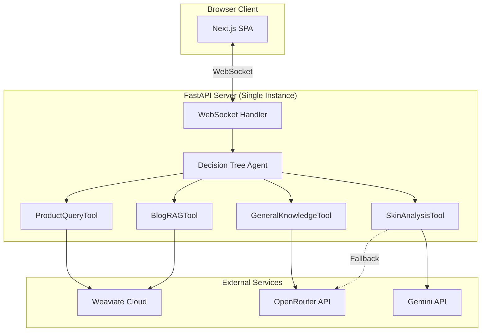
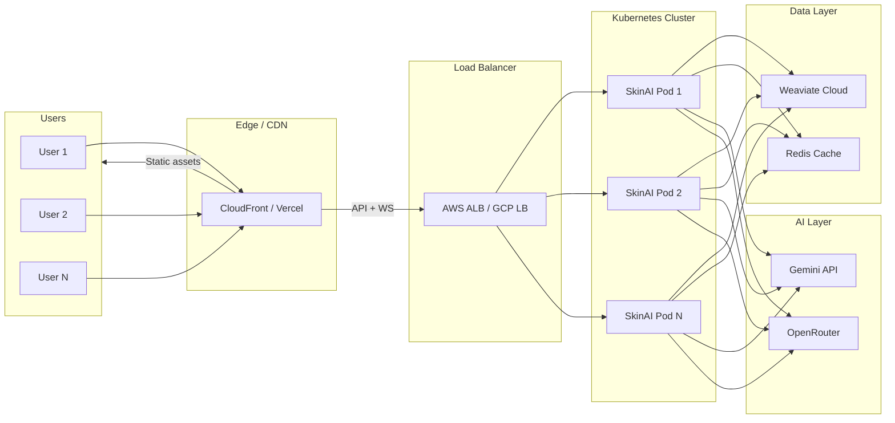

# Scalability Architecture — Clinikally SkinAI

This document details how the Clinikally SkinAI system can scale from a local prototype to a highly available, production-grade deployment serving thousands of concurrent users.

---

## Current Architecture



**Current capacity**: ~10–20 concurrent users on a single `uvicorn` worker.

---

## 1. Application Server Layer

### Current State
- Single FastAPI/Uvicorn instance on port 8000
- WebSocket connections for streaming responses
- Stateless request handling (conversation state stored in Weaviate)

### Scaling Strategy

#### Horizontal Scaling
```
                    ┌─── Uvicorn Worker 1 (CPU core 1)
Load Balancer ──────┼─── Uvicorn Worker 2 (CPU core 2)
(Nginx/ALB)         ├─── Uvicorn Worker 3 (CPU core 3)
                    └─── Uvicorn Worker 4 (CPU core 4)
```

- **Multiple workers**: `uvicorn skinai.api.app:app --workers 4` scales linearly with CPU cores
- **WebSocket affinity**: Use sticky sessions (IP hash or cookie-based) at the load balancer to maintain WebSocket connections
- **Container orchestration**: Deploy via Docker + Kubernetes with Horizontal Pod Autoscaler (HPA) triggered by CPU/memory usage or active WebSocket count

```yaml
# Example Kubernetes HPA
apiVersion: autoscaling/v2
kind: HorizontalPodAutoscaler
spec:
  minReplicas: 2
  maxReplicas: 20
  metrics:
    - type: Resource
      resource:
        name: cpu
        target:
          type: Utilization
          averageUtilization: 70
```

#### Stateless Design
The backend is fully stateless by design:
- Conversation trees are persisted in Weaviate
- Session data is stored client-side (`localStorage`)
- No server-side session affinity required for REST endpoints
- Any backend worker can serve any request

**Estimated capacity**: ~200 concurrent users per 4-core server instance.

---

## 2. Vector Database Layer (Weaviate Cloud)

### Current State
- Weaviate Cloud (WCD) with two preprocessed collections: `SkincareProducts` (~500 objects) and `SkincareBlogs` (~100 objects)
- Hybrid search: dense vector (semantic similarity) + BM25 (keyword matching)

### Scaling Strategy

| Strategy | Implementation |
|----------|----------------|
| **Auto-sharding** | WCD automatically distributes data across shards as collections grow |
| **Read replicas** | Enable read replicas for the `SkincareProducts` collection (highest query volume) |
| **Connection pooling** | Reuse Weaviate client connections across requests via `ClientManager` |
| **Query caching** | Add a Redis cache layer for frequent queries (e.g., "moisturizer for oily skin") with 5-minute TTL |

#### Caching Architecture
```
Client Query
    │
    ▼
┌──────────┐    Cache Hit     ┌───────┐
│ SkinAI   │ ──────────────── │ Redis │
│ Backend  │    Cache Miss    │ Cache │
│          │ ──────┐          └───────┘
└──────────┘       │
                   ▼
              ┌──────────┐
              │ Weaviate │
              │ Cloud    │
              └──────────┘
```

Cache key strategy:
```python
# Deterministic cache key from query + filters
cache_key = hashlib.md5(f"{query}:{skin_type}:{price_max}:{category}".encode()).hexdigest()
```

**Estimated capacity**: Weaviate Cloud handles 1,000+ QPS for collections under 100K objects.

---

## 3. LLM / Inference Layer

### Current State
- **Routing decisions**: DSPy predictors using OpenRouter (`openai/gpt-oss-120b:free`)
- **Response generation**: Same model via OpenRouter
- **Vision analysis**: Gemini 2.5 Flash with 5-model fallback chain

### Scaling Strategy

#### Rate Limit Management
```python
# Already implemented: Multi-model retry chain for vision
attempts = [
    {"model": "gemini/gemini-2.5-flash", "api_key": gemini_key},
    {"model": "gemini/gemini-2.0-flash", "api_key": gemini_key},
    {"model": "openrouter/google/gemini-2.0-flash-exp:free", "api_key": openrouter_key},
    {"model": "openrouter/qwen/qwen2.5-vl-72b-instruct:free", "api_key": openrouter_key},
    {"model": "openrouter/meta-llama/llama-4-scout:free", "api_key": openrouter_key},
]
```

#### Production Recommendations

| Strategy | Description |
|----------|-------------|
| **API key rotation** | Multiple Gemini/OpenRouter API keys rotated per-request to distribute quotas |
| **Cost-tier routing** | Use lightweight models (`BASE_MODEL`) for routing decisions, expensive models (`COMPLEX_MODEL`) only for final generation |
| **Request queuing** | Add a task queue (Celery + Redis) for image analysis requests to handle burst traffic |
| **Response caching** | Cache LLM responses for identical queries (especially general knowledge) |
| **Streaming backpressure** | Implement WebSocket backpressure to prevent memory buildup under slow client connections |

#### Cost Optimization

| Component | Free Tier | Paid Tier (Recommended) |
|-----------|-----------|------------------------|
| Routing LLM | OpenRouter free models | Gemini 2.0 Flash (~$0.10/1M tokens) |
| Response LLM | OpenRouter free models | Gemini 2.5 Flash (~$0.15/1M tokens) |
| Vision analysis | Gemini 2.0 Flash free | Gemini 2.5 Flash ($0.15/1M tokens) |
| **Est. cost/1000 queries** | **$0** | **~$0.50** |

---

## 4. Frontend Layer

### Current State
- Pre-built Next.js SPA served as static files from `api/static/`
- Client-side conversation persistence via `localStorage`

### Scaling Strategy

| Strategy | Implementation |
|----------|----------------|
| **CDN deployment** | Serve the static SPA bundle from a CDN (CloudFront, Cloudflare Pages, or Vercel Edge) |
| **Asset optimization** | Gzip/Brotli compression for JS bundles (already minified by Next.js build) |
| **WebSocket connection management** | Implement reconnection logic with exponential backoff on the client |
| **Lazy loading** | Code-split non-critical UI components |

---

## 5. Graceful Degradation

The system is designed to never leave the user without a response:

| Failure Scenario | Fallback Behavior |
|-----------------|-------------------|
| Weaviate Cloud unreachable | `ProductQueryTool` / `BlogRAGTool` catch the exception and fall back to `GeneralKnowledgeTool` |
| Gemini API quota exceeded | 5-model retry chain across Gemini direct + OpenRouter free models |
| OpenRouter API failure | Decision tree retries with exponential backoff; yields a graceful error message |
| WebSocket disconnect | Client auto-reconnects; conversation state persisted in Weaviate |
| All LLMs unavailable | Returns a pre-written error message with helpful guidance |

---

## 6. Monitoring & Observability (Production Recommendations)

| Layer | Tool | Metrics |
|-------|------|---------|
| **Application** | Prometheus + Grafana | Request latency, WebSocket connections, error rates |
| **LLM** | LangSmith / Weights & Biases | Token usage, model latency, routing accuracy |
| **Database** | Weaviate Cloud Console | Query latency, collection sizes, shard health |
| **Infrastructure** | Kubernetes Dashboard | Pod CPU/memory, autoscaler events, restart counts |

### Key Alerts

- LLM API error rate > 5% in 5 minutes
- Average WebSocket response time > 30 seconds
- Weaviate query latency P95 > 2 seconds
- Memory usage > 80% on any pod

---

## 7. Deployment Architecture (Production)



### Estimated Production Capacity

| Configuration | Concurrent Users | Queries/min | Est. Monthly Cost |
|--------------|-----------------|-------------|-------------------|
| 1 pod (2 workers) | ~20 | ~60 | $0 (free tier) |
| 4 pods (4 workers each) | ~200 | ~600 | ~$150/month |
| 10 pods + Redis + CDN | ~1,000 | ~3,000 | ~$500/month |
| 20 pods + auto-scale | ~5,000 | ~15,000 | ~$1,500/month |

*Costs assume Gemini paid tier + managed Kubernetes + Weaviate Cloud Standard.*
